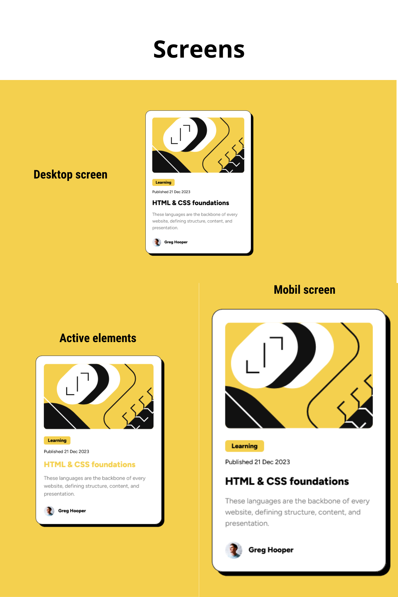

# Blog preview card

This is my solution to the Blog preview card challenge on Frontend Mentor

## Table of contents

- [Overview](#overview)
  - [The challenge](#the-challenge)
  - [Screenshot](#screenshot)
  - [Links](#links)
- [My process](#my-process)
  - [Built with](#built-with)
  - [Useful resources](#useful-resources)
- [Author](#author)

## Overview

### The challenge

Users be able to:

- See hover and focus states for all interactive elements on the page
- Responsive design

### Screenshot

### Links

- Solution URL: [Blog preview card with HTML and CSS](https://www.frontendmentor.io/solutions/blog-preview-card-with-html-and-css-WM68XNO0UJ)
- Live Site URL: [Live site](https://oppahero.github.io/blog-preview-card/)

## My process

### Built with

- Semantic HTML5 markup
- CSS custom properties
- Flexbox
- Mobile-first workflow

### Useful resources

- [MDN Web docs](https://developer.mozilla.org/es/docs/Web/CSS) 

## Author

- Frontend Mentor - [@oppahero](https://www.frontendmentor.io/profile/oppahero)
